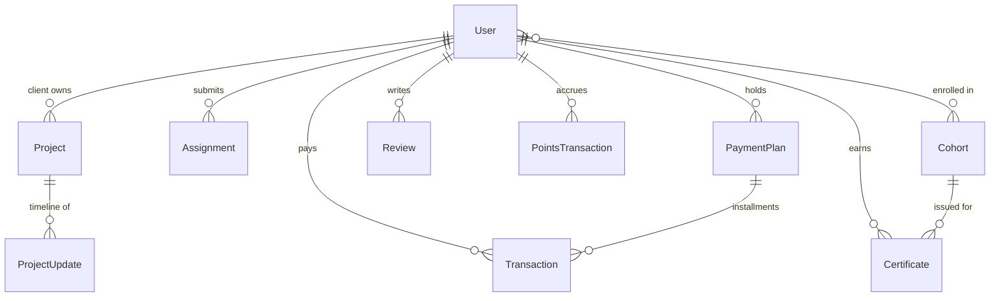

# E-Bringgs Technologies — Full Application Flow

End-to-end walkthrough of how the system fits together: repositories, startup,
auth, routing, features, data and real-time.

> **Companion docs:** [ARCHITECTURE.md](ARCHITECTURE.md) for design rationale ·
> [API.md](API.md) for endpoint-level detail · [Client-flow.md](Client-flow.md)
> for the service purchase journey. Interactive OpenAPI docs are generated from
> the route JSDoc and served at `/api/docs`.

## Table of Contents

1. [Architecture Overview](#1-architecture-overview)
2. [Repository Structure](#2-repository-structure)
3. [Startup Flow](#3-startup-flow)
4. [Authentication Flow](#4-authentication-flow)
5. [Routing & Page Map](#5-routing--page-map)
6. [Backend API Surface](#6-backend-api-surface)
7. [Feature Flows](#7-feature-flows)
8. [Data Models](#8-data-models)
9. [Real-Time (WebSocket)](#9-real-time-websocket)
10. [Security](#10-security)
11. [Environment Variables](#11-environment-variables)

---

## 1. Architecture Overview

```
┌──────────────┬──────────────┬──────────────┬──────────────────────┐
│  apps/web    │  apps/admin  │ apps/teacher │  e-bringgs-mobile    │
│  public +    │  admin       │  teacher     │  Flutter · Riverpod  │
│  student +   │  console     │  console     │  go_router · Dio     │
│  client      │              │              │  flutter_webrtc      │
└──────┬───────┴──────┬───────┴──────┬───────┴──────────┬───────────┘
       │ REST         │              │                  │ REST + WS
       ▼              ▼              ▼                  ▼
┌────────────────────────────────────────────────────────────────────┐
│              NODE HTTP SERVER — one process, one port              │
│                                                                    │
│  Express  /api/*                    ws  WebSocketServer  /ws       │
│  helmet · cors · rate-limit · json   join / offer / answer / ICE    │
│  24 route modules                    chat · mute-all · kick        │
│  23 controllers                      attendance                    │
│  19 Mongoose models                                                │
└───────┬──────────────────────────────────────────────┬─────────────┘
        │                                              │
        ▼                                              ▼
┌──────────────────┐        External: Paystack · Nodemailer (SMTP)
│  MongoDB Atlas   │                  WhatsApp Cloud API · Gemini
│ dev/staging/prod │                  Web Push (VAPID)
└──────────────────┘
```

**Tech stack**

- **Web:** React 19, TypeScript, Vite 7, Tailwind CSS v4 (CSS-first — no
  `tailwind.config.js`), Zustand 5 (auth + theme), TanStack Query 5 (server
  state), React Router 7, axios
- **API:** Node, Express 4, TypeScript, Mongoose 8, JWT access + refresh,
  bcryptjs, Zod, Helmet, express-rate-limit, Multer, swagger-jsdoc,
  Paystack over raw `https`
- **Real-time:** `ws` for WebRTC signaling
- **Mobile:** Flutter, Riverpod, go_router, Dio, flutter_webrtc
- **Hosting:** Vercel (web) · Render (API) · MongoDB Atlas

---

## 2. Repository Structure

Three repositories, deliberately separate.

```
e-bringgs/                        # pnpm workspace — the web tier
├── apps/
│   ├── web/       public site + student dashboard + client dashboard
│   ├── admin/     admin console
│   └── teacher/   teacher console
├── packages/
│   ├── api/       axios instance · refresh interceptor · QueryClient
│   ├── auth/      Zustand auth store + theme store
│   ├── classroom/ WebRTC classroom · annotation overlay · recording upload
│   ├── styles/    Tailwind v4 CSS-first config · brand tokens · animations
│   ├── types/     shared TypeScript contracts
│   └── ui/        Logo · useSEO · PageTransition · primitives
└── screenshots/   captures of the live deployment

backend/                          # separate repo — deploys to Render
└── src/
    ├── index.ts        boots ONE http.Server hosting Express + WebSocketServer
    ├── app.ts          middleware order (see §3)
    ├── routes/         24 modules — verb + path + middleware chain
    ├── controllers/    23 modules — business logic
    ├── models/         19 Mongoose schemas
    ├── middleware/     protect · authorize · errorHandler · validate
    ├── services/       points · whatsapp · email · siteAssistant · aiTutor
    ├── config/         db · swagger · services.catalog · tutoring.catalog
    ├── signaling/      WebSocket classroom server
    ├── jobs/           cron — session reminders, installment charging
    ├── validators/     Zod schemas
    └── scripts/        seedAdmin

e-bringgs-mobile/                 # separate repo — Flutter
```

**Why three web apps:** a visitor loading the marketing site should never
download the admin console. Separate builds make that impossible by
construction; separate subdomains keep an admin session out of the public
origin.

---

## 3. Startup Flow

```bash
# Web tier (pnpm workspace)
pnpm dev            # web + backend together
pnpm dev:admin      # admin console
pnpm dev:teacher    # teacher console

# API (separate repo, npm)
npm run dev         # NODE_ENV=development
npm run dev:staging # NODE_ENV=staging
npm run dev:prod    # NODE_ENV=production
```

### Backend startup sequence

```
index.ts
  ├── dotenv.config()
  ├── connectDB()                 # picks MONGO_URI_<ENV> by NODE_ENV
  ├── createServer(app)           # HTTP server wrapping Express
  ├── new WebSocketServer({ server, path: '/ws' })
  │     └── setupSignalingServer(wss)
  ├── registerJobs()              # cron: session reminders, installments
  └── httpServer.listen(PORT)
```

### Express middleware order — load-bearing

```
app.ts
  1. helmet()                        security headers
  2. cors({ origin: allowedOrigin })  apex + www variants, plus localhost
  3. rateLimit(100 / 15 min)          scoped to /api
  4. express.json()                   body parser
  5. /api/* route modules             24 of them
  6. /uploads (static)                Multer-saved files
  7. /api/docs                        Swagger UI
  8. 404 handler
  9. errorHandler                     global, formats { status, message }
```

> **Note on webhooks.** Paystack verifies its signature against
> `JSON.stringify(req.body)`, so the webhook works *after* the JSON parser and
> needs no raw-body handling. A future provider that signs the raw bytes would
> have to be mounted **before** step 4.

---

## 4. Authentication Flow

Four roles: `student` · `client` · `teacher` · `admin`.

### Registration

```
POST /api/auth/register  { name, email, password, role, referralCode? }
  ├── Zod validation
  ├── Email uniqueness check
  ├── User.create()  — password hashed by pre-save hook (bcrypt, 12 rounds)
  ├── Generate emailVerificationToken → send verification email
  ├── Sign access (15m) + refresh (7d) tokens
  └── { user, accessToken, refreshToken }
```

### Login and refresh

```
POST /api/auth/login  { email, password }
  └── { user, accessToken, refreshToken }

Interceptor sees 401
  ├── POST /api/auth/refresh  { refreshToken }
  ├── Retry the original request with the new access token
  └── Refresh itself fails → clear tokens → /login
```

**Token storage on web.** Tokens live in *two* places — the persisted Zustand
state and raw `localStorage` keys — because the axios interceptor reads the raw
keys directly during refresh. Removing either half breaks refresh.

**Role → destination.** Admin and teacher authenticate per-origin on their own
subdomains, so login on the public app redirects them by full URL rather than
client-side navigation.

### Middleware

```
protect              verify JWT → populate req.user { userId, role }
authorize(...roles)  role gate, chains after protect
requireStudentAccess / requireProjectAccess   feature + ownership gates
```

Handlers reading `req.user` must be typed `AuthRequest`, not `Request` —
`protect` is the only thing that populates it.

### OAuth

`POST /api/auth/oauth/google` and `/oauth/apple` exchange a provider ID token
for a session. **Currently switched off** behind a single feature flag per
client pending provider setup.

---

## 5. Routing & Page Map

### apps/web — standalone (no layout)

| Route | Description |
|---|---|
| `/login` · `/register` | Split-panel auth; register is a 5-step wizard |
| `/forgot-password` · `/reset-password` · `/verify-email` | Password + email flows |
| `/checkout` | Paystack initialise → hosted checkout |
| `/payment/success` · `/payment/failed` | Verify reference, settle |
| `/payments/plan/:id` | Installment plan detail |
| `/classroom/:roomId` | Full-screen WebRTC room |

### apps/web — public layout

`/` · `/pricing` · `/services` · `/services/:slug` · `/blog` · `/blog/:slug` ·
`/about` · `/how-it-works` · `/success-stories[/:slug]` · `/portfolio[/:slug]` ·
`/schedule` · `/instructors` · `/contact` · `/terms` · `/privacy` ·
`/verify-certificate` · `/certificate/:courseId`

### apps/web — student dashboard (`/dashboard/*`)

`index` · `schedule` · `assignments` · `recordings` · `instructors[/:id]` ·
`services[/:id]` · `leaderboard` · `reviews` · `profile`

### apps/web — client dashboard (`/client/*`)

`index` · `projects[/:projectId]` · `projects/:projectId/brief` · `payments` ·
`services[/:id]` · `schedule-call` · `reviews` · `profile`

### apps/admin

Overview · Users · Cohorts · LiveSessions · Projects · Assignments · Payments ·
PaymentPlans · Blogs · CaseStudies · Reviews · ServiceRequests · Settings ·
Profile · Login

### apps/teacher

Overview · Sessions · Students · Assignments · Recordings · Resources ·
Profile · Login

---

## 6. Backend API Surface

24 route modules mounted under `/api`. Full detail in **[API.md](API.md)**;
this is the map.

| Mount | Purpose |
|---|---|
| `/auth` | register · login · refresh · OAuth · password reset · email verify |
| `/users` | profile, password, teacher directory, admin role management |
| `/tutoring` | cohort + mentorship catalog (server-authoritative) |
| `/services` | productized service catalog + custom-quote inquiries |
| `/cohorts` | intakes with capacity and derived status |
| `/live-sessions` | individual classes within a cohort |
| `/projects` | client projects, briefs, activity timeline |
| `/assignments` | student submission and admin grading |
| `/paystack` | initialize · verify · transactions · webhook |
| `/payment-plans` | installment plans, extend, mark paid |
| `/points` | balance and leaderboard |
| `/vouchers` | gift vouchers |
| `/certificates` | issue, revoke, **public verification** |
| `/recordings` | class recording upload and listing |
| `/reviews` | submit, moderate, feature |
| `/blogs` · `/case-studies` | content |
| `/ai-tutor` · `/site-assistant` | Gemini-backed assistants |
| `/push` | Web Push subscriptions (VAPID) |
| `/admin` | stats, inquiries, unread counts |
| `/public` | aggregated stats, cached 5 min server-side |
| `/upload` · `/newsletter` | file upload, mailing list |

**Response envelopes** are uniform — success is
`{ status: 'success', data: {...} }`, failure is `{ status: 'error', message }`
produced centrally by `next(new AppError(msg, code))`.

---

## 7. Feature Flows

### Service purchase → project kickoff

```
/client/services → /client/services/:id → /checkout?type=service&id=:id
  ├── POST /paystack/initialize
  │     ├── Price resolved SERVER-SIDE from the catalog (never trusted from client)
  │     ├── Discounts stack: points → voucher → referral credit, each capped
  │     └── Optional 2x/3x installment plan created
  ├── Paystack hosted checkout
  ├── /payment/success → GET /paystack/verify/:reference
  ├── Project auto-created, status: awaiting_brief, isPaid: true
  ├── /client/projects/:id/brief — service-specific intake form
  └── Submit → status: in_progress, admins notified (push + email)
```

Project creation is **idempotent**: `ensureProjectForServicePurchase()` looks up
an existing project by payment reference first. It is called from both the
verify endpoint and the webhook — whichever arrives first creates it.

### Custom quote

```
Non-productized service → inquiry form
  └── POST /services/inquire   (name + email auto-filled from the auth'd user)
        └── ServiceInquiry created → admins notified → worked in /admin/service-requests
```

### Cohort enrolment

```
/pricing or /schedule → /checkout?type=plan&id=<trackId>
  └── On success, student is enrolled; cohort capacity and derived status update
```

### Assignment submission

```
POST /api/assignments (multipart, student)
  ├── Multer stores the file → /uploads/<filename>
  ├── Points awarded (idempotent on assignment id)
  └── Admins notified

PATCH /api/assignments/:id/review (admin)  { feedback, grade }
  ├── status → 'reviewed'
  ├── Points awarded if the grade is a pass
  └── Student notified
```

### Live classroom

```
Admin schedules a session in /admin/live-sessions → roomId generated
Student opens /classroom/:roomId
  ├── WebSocket connects to /ws
  ├── { type: 'join', roomId, userId, name }
  ├── Server replies 'room-participants', broadcasts 'user-joined'
  ├── Chat, presence, mute-all, kick all live over the socket
  └── Local camera/mic controls, screen share, teacher-side recording
```

> **Current limitation.** Signaling is complete and symmetrical across web and
> mobile, but neither client constructs an `RTCPeerConnection` yet — so
> **remote video does not flow**. Chat, presence and local media work.

---

## 8. Data Models

19 Mongoose models. Amounts are **kobo** (₦1 = 100 kobo).



**Full set:** User · Cohort · LiveSession · Project · ProjectUpdate ·
Assignment · Transaction · PaymentPlan · PointsTransaction · Voucher ·
Certificate · Recording · Review · Blog · CaseStudy · ServiceInquiry ·
Newsletter · PushSubscription · Counter

### Key schemas

**User** — `name · email · password (select:false, bcrypt 12) · role
(admin|student|teacher|client) · avatar · bio · isEmailVerified · points ·
referralCode · referredBy · referralCreditNaira · phone · whatsappOptIn`

**Cohort** — `title · slug · planId · startDate · endDate · capacity ·
enrolledCount · isEnrollmentOpen · status`. A `deriveCohortStatus()` helper
computes the *effective* status from dates and capacity; public controllers run
it before responding and **clients never re-derive**.

**Project** — `client · serviceId · serviceName · title · description · status
(awaiting_brief|pending|in_progress|review|completed|cancelled) · progress ·
githubRepo · liveUrl · deliverables[] · timeline[] · totalCost (kobo) · isPaid ·
paystackReference · brief · briefSubmittedAt`

**Transaction** — `user · stripePaymentIntentId · amount (kobo) · currency ·
status · type (one_time|subscription|installment) · paymentPlanId ·
installmentNumber`

> ⚠️ **Legacy field name.** `stripePaymentIntentId` stores the **Paystack
> reference** since the provider migration. Renaming needs a migration across
> live payment records, so the field is treated as opaque.

There is **no `Course` model** — training content is modelled as `Cohort`
(an intake) plus a server-side tutoring catalog of tracks.

---

## 9. Real-Time (WebSocket)

**Path:** `/ws` — same HTTP server and port as the REST API.

### Client → server

```json
{ "type": "join",          "roomId": "...", "userId": "...", "name": "..." }
{ "type": "offer",         "targetId": "...", "sdp": {...} }
{ "type": "answer",        "targetId": "...", "sdp": {...} }
{ "type": "ice-candidate", "targetId": "...", "candidate": {...} }
{ "type": "chat",          "text": "..." }
{ "type": "mute-all" }
{ "type": "kick",          "targetId": "..." }
{ "type": "attendance" }
```

### Server → client

```json
{ "type": "room-participants", "participants": [{ "userId", "name" }] }
{ "type": "user-joined",       "userId": "...", "name": "..." }
{ "type": "user-left",         "userId": "...", "name": "..." }
{ "type": "chat",              "fromId", "fromName", "text", "timestamp" }
{ "type": "mute-all",          "fromId": "..." }
{ "type": "kicked" }
{ "type": "attendance-update", "participants": [...] }
```

SDP and ICE frames are relayed to `targetId` and stamped with `fromId` /
`fromName`. Malformed frames are ignored rather than erroring the connection.

**Consequence of in-memory state:** the participant map lives in-process, so the
signaling server is single-instance. Horizontal scaling would need a Redis
pub/sub backplane.

---

## 10. Security

| Layer | Implementation |
|---|---|
| **Auth** | JWT access (15m) + refresh (7d), configurable via env |
| **Passwords** | bcryptjs, 12 salt rounds, `select: false` on the field |
| **Headers** | Helmet |
| **CORS** | Allowlist of configured origins expanded to apex + `www`, plus localhost. Disallowed origins rejected with `false`, never a thrown error |
| **Rate limiting** | 100 req / 15 min per IP on `/api`; 10 req / min on `/ai-tutor/ask` |
| **Validation** | Zod schemas at the route boundary |
| **File upload** | Multer MIME allowlist, size cap |
| **Paystack webhook** | HMAC-SHA512 verified against `x-paystack-signature` |
| **Pricing** | Resolved server-side from a catalog — client amounts not trusted |
| **Concurrency** | Referral credit decremented via guarded `findOneAndUpdate` so parallel checkouts cannot double-spend |
| **Ownership** | `requireProjectAccess` / `requireStudentAccess` gates beyond role checks |

---

## 11. Environment Variables

### Backend

```env
# Database — one cluster per environment, selected by NODE_ENV
MONGO_URI=
MONGO_URI_DEVELOPMENT=
MONGO_URI_STAGING=
MONGO_URI_PRODUCTION=

# Auth
JWT_SECRET=
JWT_REFRESH_SECRET=
JWT_EXPIRES_IN=15m
JWT_REFRESH_EXPIRES_IN=7d

# Payments
PAYSTACK_SECRET_KEY=

# AI assistants (site assistant + student AI tutor share this key)
GEMINI_API_KEY=
AI_TUTOR_DAILY_LIMIT=

# Email
SMTP_HOST=
SMTP_PORT=
SMTP_USER=
SMTP_PASS=
EMAIL_FROM=

# Web Push
VAPID_PUBLIC_KEY=
VAPID_PRIVATE_KEY=
VAPID_SUBJECT=

# WhatsApp Cloud API (optional — no-ops when unset)
WHATSAPP_ACCESS_TOKEN=
WHATSAPP_PHONE_NUMBER_ID=

# OAuth (feature-flagged off)
GOOGLE_CLIENT_ID=
APPLE_CLIENT_ID=

# Origins — each is CORS-allowed in both apex and www form
CLIENT_URL=
USER_URL=
TEACHER_URL=
ADMIN_URL=

# Admin seed (npm run seed:admin)
ADMIN_EMAIL=
ADMIN_PASSWORD=
ADMIN_NAME=

PORT=5000
NODE_ENV=development
```

### Web apps (`apps/*/.env.local`)

```env
VITE_API_URL=https://<api-host>/api
VITE_WS_URL=wss://<api-host>/ws
VITE_ADMIN_URL=
VITE_TEACHER_URL=
VITE_WHATSAPP_NUMBER=
VITE_CALENDLY_URL=
VITE_GOOGLE_CLIENT_ID=
VITE_APPLE_CLIENT_ID=
```

### Mobile (`.env`)

```env
API_URL=https://<api-host>/api
WS_URL=wss://<api-host>/ws
WHATSAPP_NUMBER=
GOOGLE_WEB_CLIENT_ID=
PAYSTACK_PUBLIC_KEY=
```

---

## Quick Start

```bash
# Web tier
pnpm install
pnpm dev                 # web + backend
pnpm typecheck           # all workspace packages
pnpm lint

# API
cd ../backend
npm install
cp .env.example .env     # fill in the values above
npm run dev
npm run seed:admin       # create the first admin from ADMIN_* vars

# Mobile
cd ../e-bringgs-mobile
flutter pub get
flutter run
```

| Service | Local URL |
|---|---|
| Web | http://localhost:5173 |
| Admin | http://localhost:5174 |
| Teacher | http://localhost:5175 |
| API | http://localhost:5000 |
| API docs | http://localhost:5000/api/docs |
| WebSocket | ws://localhost:5000/ws |

> **No test runner is configured** in any package. Correctness currently rests
> on TypeScript, Zod validation at the route boundary, and manual verification.
