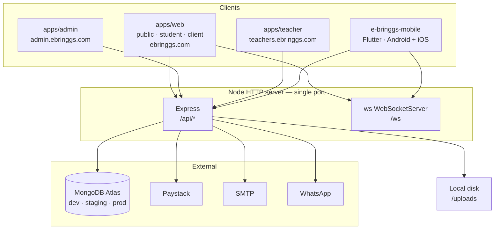
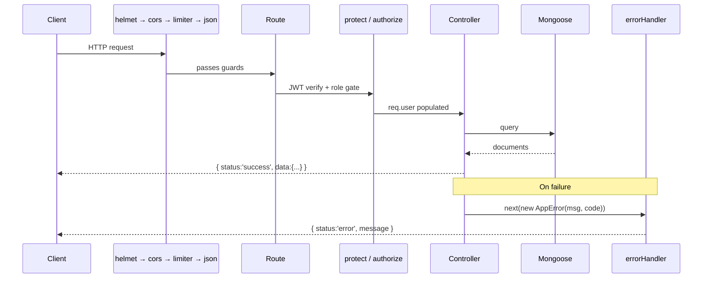
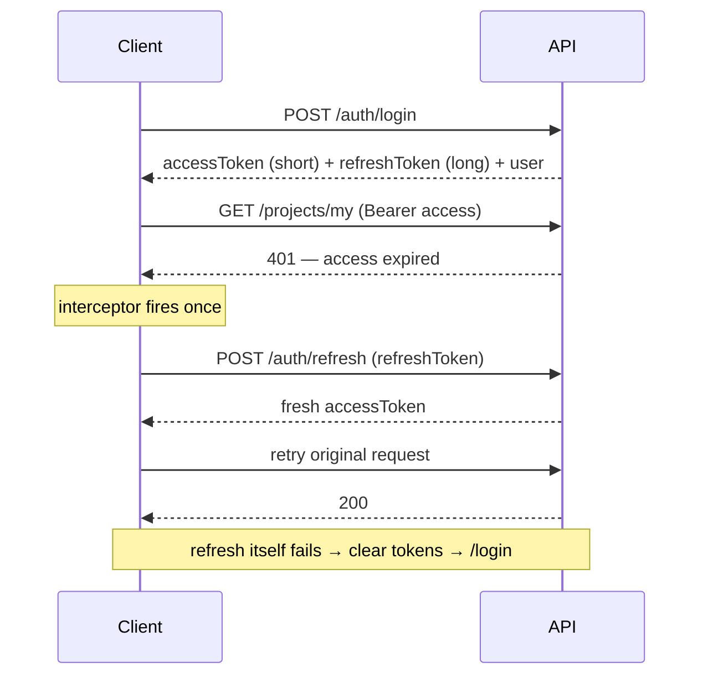
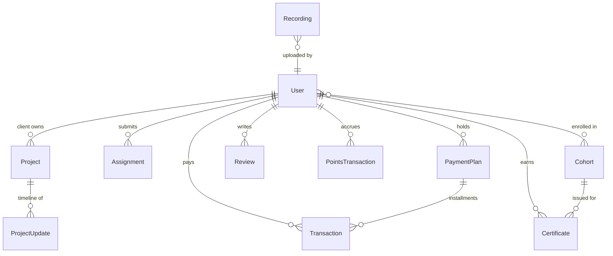

# Architecture

How the E-Bringgs platform is put together, and why. For the narrative version —
the problem, the trade-offs, the roadmap — see [CASE_STUDY.md](CASE_STUDY.md).
For endpoint-level detail see [API.md](API.md).

---

## 1. System context

Three separately deployed web apps, one Flutter mobile app, and one Node process
that serves both REST and WebSocket traffic.



**Hosting:** Vercel for the three web apps, Render for the API, MongoDB Atlas
for data.

---

## 2. Repository topology

Three git repositories, deliberately not one.

| Repo | Contents | Why separate |
|---|---|---|
| `e-bringgs` | pnpm workspace: 3 apps + 6 shared packages | Front-ends share code, so they share a repo |
| `backend` | Express + Mongoose API | Deploys on its own cadence to a different platform; no shared build tooling with the front-ends |
| `e-bringgs-mobile` | Flutter app | Entirely different toolchain (Dart/Gradle/Xcode). Consumes the same API as a peer |

### The web workspace

```
e-bringgs/
├─ apps/
│  ├─ web/        public marketing + student dashboard + client dashboard
│  ├─ admin/      admin console
│  └─ teacher/    teacher console
└─ packages/
   ├─ api/        axios instance · refresh interceptor · shared QueryClient
   ├─ auth/       Zustand auth store + theme store
   ├─ classroom/  WebRTC classroom · annotation overlay · recording upload
   ├─ styles/     Tailwind v4 CSS-first config · brand tokens · animations
   ├─ types/      shared TypeScript contracts
   └─ ui/         Logo · useSEO · PageTransition · primitives
```

**Why three apps rather than one.** A prospective student loading the marketing
site should never download the admin console. Route-level splitting inside one
app helps, but nothing stops an admin-only dependency landing in a shared chunk.
Separate builds make it impossible by construction, and separate subdomains mean
an admin session cannot leak into the public origin.

The cost — three build pipelines, three deploy targets, cross-cutting changes
touching three manifests — is bounded by the shared packages.

---

## 3. Backend structure

Layered MVC, held to strictly.

```
backend/src/
├─ index.ts          boots ONE http.Server hosting Express + WebSocketServer
├─ app.ts            middleware order (see below)
├─ routes/           24 modules — HTTP verb + path + middleware chain
├─ controllers/      23 modules — business logic
├─ models/           19 Mongoose schemas
├─ middleware/       protect · authorize · errorHandler · validate · access gates
├─ services/         points · whatsapp · email — cross-controller logic
├─ config/           db · swagger · services.catalog · tutoring.catalog
├─ signaling/        WebSocket classroom server
├─ jobs/             scheduled tasks (session reminders, installment charging)
├─ validators/       Zod schemas
└─ utils/            AppError · email · pushNotification
```

### Middleware order — `app.ts`

Order is load-bearing:

1. `helmet` — security headers
2. `cors` — origin allowlist (apex + `www` variants, plus localhost)
3. `express-rate-limit` — scoped to `/api`
4. **JSON body parser**
5. All `/api/*` route modules
6. Static `/uploads` for Multer-saved files
7. Swagger UI at `/api/docs`
8. 404 catch-all
9. Global `errorHandler`

> Paystack's webhook verifies its signature against `JSON.stringify(req.body)`,
> so it works *after* the parser. A provider that signs raw bytes would need
> mounting **before** step 4.

### Request lifecycle



---

## 4. Authentication

Two-token JWT. No sessions, no server-side state.



**`protect`** verifies the JWT and populates `req.user`. Handlers that read it
must be typed `AuthRequest`, not `Request` — `protect` is the only thing that
populates it. **`authorize(...roles)`** chains after it for role gating.

**Token storage on web.** Tokens live in *two* places: the persisted Zustand
state and raw `localStorage` keys. The axios interceptor reads the raw keys
directly during refresh, so removing either half breaks it. Redundant and
documented as such.

**Role → destination.** Admin and teacher authenticate per-origin on their own
subdomains, so login on the public app redirects them by full URL rather than
client-side navigation.

---

## 5. Data model

19 Mongoose models. The relationships that matter:



### Two distinctions that are easy to get wrong

**Cohort vs LiveSession.** A `Cohort` is one *intake* — a start date to count
down to, with a capacity. A `LiveSession` is one *class* within it — an
individual video room. They are separate models on purpose. The public
`/schedule` page renders both; admin manages them on separate pages.

**Transaction's legacy field.** `Transaction.stripePaymentIntentId` stores the
**Paystack reference** since the payment-provider migration. Renaming requires a
migration across live payment records, so the field is treated as opaque and
documented everywhere it appears.

### Money

All amounts are **kobo** (₦1 = 100 kobo). Conversion to naira happens at the
display layer only.

---

## 6. Cross-cutting conventions

### Uniform response envelopes

Success is always `{ status, data }`; failure is always `{ status, message }`,
produced centrally by `next(new AppError(msg, code))`. Four clients unwrap
responses identically, so a new endpoint needs no new parsing anywhere.

### Derived status

Several models carry a `status` an admin can set, alongside a
`deriveXxxStatus()` helper computing the *effective* status from raw fields and
the current time. Public controllers run the helper before responding; **clients
never re-derive.**

This removes a bug class outright: four clients cannot disagree about whether a
cohort is open, because none of them decides. Any entity whose status changes
with the clock should follow this pattern.

### Server-authoritative pricing

`POST /paystack/initialize` resolves price from the server catalog by
`serviceId`. A client-supplied `amount` is honoured only on the legacy
training-plan path — closing that gap is an open TODO.

### Idempotent settlement

Payment verification runs from two entry points — the client hitting
`/verify/:reference` and Paystack's webhook. Either may arrive first, so both
call the same settlement path and every step is safe to repeat.

### Atomic balance spending

Referral credit is decremented with a conditional `findOneAndUpdate` guarded on
sufficient balance, so two parallel checkouts cannot spend it twice.

---

## 7. Real-time classroom

Express and the `ws` `WebSocketServer` **share one HTTP server and one port.**

The reasoning: a classroom needs signaling and REST in lockstep. The same JWT
authorises both; session metadata lives in Mongo while offer/answer traffic flows
over the socket. Splitting them means two deploy units, two certificates and a
second auth path — to solve a scaling problem the platform does not have yet.

The signaling protocol is a thin relay: `join`, `offer`, `answer`,
`ice-candidate`, `chat`, `mute-all`, `kick`, `attendance`. The server keeps an
in-memory `Map<WebSocket, Client>` and forwards by `targetId`. Full message
reference in [API.md](API.md#websocket--ws).

**Consequence of in-memory state:** the signaling server is single-instance. Two
Node processes would not share the participant map. Horizontal scaling requires
a shared backplane (Redis pub/sub) — noted, not needed yet.

**Current limitation:** signaling is complete and symmetrical across web and
mobile, but neither client constructs an `RTCPeerConnection`, so remote video
does not flow. Chat, presence and local media work. Both clients have the hook
in place.

---

## 8. Front-end architecture

### State: two kinds, two tools

| Kind | Tool | Scope |
|---|---|---|
| **Server state** | TanStack Query | Anything fetched. Caching, retry, invalidation |
| **Client state** | Zustand + `persist` | Auth session and theme only |

Keeping them separate is deliberate. Query owns freshness; Zustand owns the two
things that genuinely belong to the client and must survive a reload.

### Routing and layout

`App.tsx` declares every route directly — no route config file. Four layout
components wrap role-specific dashboards, each gated by
`<ProtectedRoute allow="...">`. The classroom and all checkout/payment pages
render **without** a layout, full-screen.

### Styling — Tailwind v4

CSS-first configuration. There is **no `tailwind.config.js`** and adding one will
not be read.

- Tokens and config live in `packages/styles/styles.css` via `@import "tailwindcss"`
- The plugin runs in each app's `vite.config.ts` (`@tailwindcss/vite`), not PostCSS
- Dark mode is class-based: `@custom-variant dark (&:is(.dark *))`, toggled on
  `<html>` by a hook reading the persisted theme store

### Mobile parity

The Flutter app mirrors the same patterns with native equivalents: Riverpod for
state, `go_router` for routing, and a Dio interceptor implementing the identical
refresh-once-then-redirect flow. It is a peer client, not a WebView wrapper —
the API contract is what keeps the two honest.

---

## 9. Environments

`config/db.ts` selects `MONGO_URI_DEVELOPMENT`, `MONGO_URI_STAGING` or
`MONGO_URI_PRODUCTION` from `NODE_ENV`, each a separate Atlas cluster, falling
back to `MONGO_URI`.

```bash
npm run dev          # NODE_ENV=development
npm run dev:staging  # NODE_ENV=staging
npm run dev:prod     # NODE_ENV=production
```

Switching environments is a start-script flag, not a file edit — which matters
most for payment work, where testing against production data is unacceptable and
otherwise easy to do by accident.

---

## 10. Known architectural debt

| Item | Impact | Notes |
|---|---|---|
| **No test suite** | Highest | No test runner in any package. Correctness rests on TypeScript, Zod at the boundary, and manual verification |
| No `RTCPeerConnection` | High | Signaling done; remote video does not flow |
| Recordings on local disk | High | `backend/uploads/recordings/` does not survive container replacement |
| In-memory signaling map | Medium | Blocks horizontal scaling of the WS server |
| `stripePaymentIntentId` name | Medium | Needs a migration across live payment records |
| Client-supplied training-plan price | Medium | Last remaining client-trusted amount |
| Dual token storage | Low | Redundant; removing either half breaks refresh |
| No route-level code splitting | Medium | See [PERFORMANCE.md](PERFORMANCE.md) |
