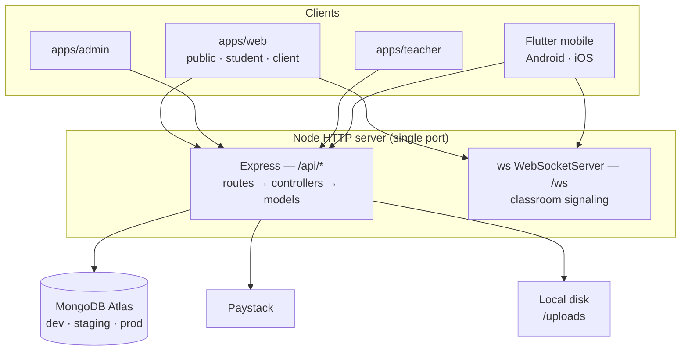

# E-Bringgs Technologies — Engineering Case Study

A single platform that runs a technology training academy and a software services
agency at the same time, serving four distinct user roles across web and mobile.

| | |
|---|---|
| **Domain** | EdTech + professional services, Nigeria-first |
| **Surfaces** | 3 web apps, 1 REST + WebSocket API, 1 Flutter mobile app |
| **Roles served** | Student, Client, Teacher, Admin |
| **API scope** | 23 controllers, 19 data models, 24 route modules |
| **Repos** | `e-bringgs` (web monorepo) · `backend` · `e-bringgs-mobile` |

---

## 1. The problem

E-Bringgs Technologies runs two businesses that most companies would keep apart:

1. **A training academy** — cohort-based programs in web development, mobile,
   UI/UX and data, taught live, with assignments, recordings, certificates and
   a leaderboard.
2. **A software services agency** — productized packages a client can buy
   outright, plus custom engagements that start as an inquiry and become a
   scoped quote.

The obvious approach is two products. That was rejected for three reasons:

- **The audiences overlap.** A client who hires the agency often sends staff
  through the academy. A graduating student becomes a candidate the agency
  places. Splitting them means splitting the customer record.
- **One brand, one login.** Asking someone to hold two accounts for one company
  is a conversion tax on both sides of the business.
- **Payments are the same problem twice.** Both sides bill in naira, both need
  installments, both need receipts and refunds. Building that machinery twice
  would be the single largest source of duplicated effort.

So the real problem was never "build a course site" or "build an agency site."
It was: **can four user types with genuinely different jobs share one identity
system, one payment engine, and one operational backend without the interfaces
collapsing into a compromise that serves nobody well?**

Concretely, the platform had to deliver:

- Cohort enrolment with capacity limits and countdown-to-start
- Live video classrooms with chat, presence and instructor controls
- Assignment submission and grading
- Client project tracking with progress, milestones, deliverables and an
  activity timeline
- Self-serve purchase of productized services, which auto-creates a project and
  collects an intake brief
- Payments in NGN with 1×/2×/3× installments, gift vouchers, loyalty points and
  referral credit — all stackable
- Certificates with public verification
- Separate admin and teacher operations consoles

---

## 2. Architecture

### Three front-ends, one shared core

The web tier is a **pnpm workspace** with three independently deployed apps
sharing six internal packages:

```
e-bringgs/
├─ apps/
│  ├─ web/        public site + student dashboard + client dashboard
│  ├─ admin/      admin console        → admin.ebringgs.com
│  └─ teacher/    teacher console      → teachers.ebringgs.com
└─ packages/
   ├─ api/        axios instance, refresh interceptor, shared query client
   ├─ auth/       Zustand auth + theme stores
   ├─ classroom/  WebRTC classroom, annotation overlay, recording upload
   ├─ styles/     Tailwind v4 CSS-first config, brand tokens, animations
   ├─ types/      shared TypeScript contracts
   └─ ui/         Logo, SEO helpers, page transitions, primitives
```

The decisive reason for three apps rather than one: **a prospective student
visiting the marketing site should never download the admin console.** Route-level
code splitting inside a single app helps, but it does not stop an admin-only
dependency from landing in a shared chunk. Separate builds make that impossible
by construction, and separate subdomains mean an admin session cannot leak into
the public origin.

The cost is real and accepted — three build pipelines, three deploy targets, and
any cross-cutting change touches three `package.json` files. The shared packages
exist specifically to keep that cost bounded.

### One server, two protocols



The Express app and the WebSocket signaling server **share one HTTP server and
one port.** A classroom needs signaling and REST in lockstep — the same JWT
authorises both, and a session's metadata lives in Mongo while its offer/answer
traffic flows over the socket. Splitting them would have meant two deploy units,
two TLS certs and a second auth path, to solve a scaling problem the platform
does not yet have.

### Layered backend

Standard MVC, held to strictly: `routes/` → `controllers/` → `models/`. Every
route file carries Swagger JSDoc annotations, and the OpenAPI spec is assembled
at boot and served at `/api/docs`, so the contract is generated from the code
rather than maintained beside it.

Two conventions carry most of the consistency:

**Uniform envelopes.** Success is always `{ status: 'success', data: {...} }`;
failure is always `{ status: 'error', message }`, produced centrally by throwing
`next(new AppError(msg, code))`. Every client — three web apps and the mobile
app — unwraps responses the same way, so a new endpoint needs no new parsing
logic anywhere.

**Derived status.** Several models carry a `status` an admin can set, alongside a
`deriveXxxStatus()` helper that computes the *effective* status from raw fields
and the current time. Public controllers always run the helper before responding.
Clients never re-derive. This kills an entire bug class: four clients cannot
disagree about whether a cohort is "open" because none of them decides.

### Multi-environment data

`config/db.ts` selects `MONGO_URI_DEVELOPMENT`, `MONGO_URI_STAGING` or
`MONGO_URI_PRODUCTION` from `NODE_ENV`, each pointing at a separate Atlas
cluster. Switching environments is a start-script flag, not an edit — which
matters most for payment work, where testing against production data is
unacceptable and easy to do by accident.

### Mobile as a peer, not a port

The Flutter app is a **separate repository** consuming the same production API.
It is deliberately not a WebView wrapper: it holds its own Riverpod state, its
own router, and native camera/mic access for the classroom. Sharing the backend
rather than the code means the contract is enforced by the API, and mobile can
ship on its own cadence.

---

## 3. Technologies used

### Web

| Concern | Choice | Why |
|---|---|---|
| Framework | React 19 + TypeScript | Team fluency; strict types across the API boundary |
| Build | Vite 7 | Fast dev server, straightforward multi-app workspace |
| Styling | Tailwind CSS v4 | **CSS-first config** — no `tailwind.config.js`; tokens live in `packages/styles` and the plugin runs in `vite.config.ts` |
| Client state | Zustand 5 + `persist` | Auth and theme only; small surface, no boilerplate |
| Server state | TanStack Query 5 | Caching, retry and invalidation belong in one place, not in components |
| Routing | React Router 7 | Nested layouts map cleanly to role-gated dashboards |
| HTTP | axios 1.13 | Interceptors for token refresh |

Dark mode is class-based (`.dark` on `<html>`) via a `@custom-variant`, driven by
a persisted store with light / dark / system modes.

### Backend

| Concern | Choice |
|---|---|
| Runtime | Node + Express 4.19 + TypeScript |
| Data | Mongoose 8.4 on MongoDB Atlas |
| Auth | `jsonwebtoken` 9 (access + refresh), `bcryptjs` |
| Real-time | `ws` 8.19 on `/ws` |
| Validation | Zod 3.23 at the route boundary |
| Hardening | `helmet` 7, `express-rate-limit` scoped to `/api` |
| Docs | `swagger-jsdoc` + `swagger-ui-express` |
| Uploads | `multer` 2 |
| Payments | Paystack over raw `https` |

Paystack is called through Node's built-in `https` rather than an SDK. The
integration touches four endpoints; a dependency that wraps them would add
supply-chain surface and a version to track for no real gain.

### Mobile

Flutter with `flutter_riverpod` 2.6, `go_router` 14.6, `dio` 5.7 (mirroring the
web refresh-interceptor pattern), `flutter_webrtc` 0.12.5 for classroom media,
`flutter_inappwebview` 6.1.5 to host Paystack checkout in-app, and
`permission_handler` for camera and microphone prompts.

### Infrastructure

Vercel for the three web apps, Render for the API, MongoDB Atlas for data.

---

## 4. Challenges encountered

### The apex-domain CORS failure

The student dashboard began showing *"Couldn't load tutoring programs."* The
tempting read was a broken tutoring endpoint. It was not — that page was simply
the only one with an explicit error card. Everywhere else, failed fetches fell
back to empty states, so the platform looked *empty* rather than *broken*, which
is a far more dangerous failure mode.

Probing the API with different `Origin` headers found it:

| Origin | Result |
|---|---|
| `https://www.ebringgs.com` | **200** |
| `https://ebringgs.com` | **500** |
| `http://localhost:5173` | **500** |

CORS whitelisted the exact strings in the environment variables. Visitors reach
the site by both apex and `www`, but only one form was configured — so half the
traffic had every API call rejected. Worse, the rejection path *threw*, which the
error handler turned into a 500, so a routine cross-origin probe looked like a
server fault in the logs.

The fix expands every configured origin into both apex and `www` forms, allows
localhost in all environments (safe here — auth is Bearer-token, so cross-origin
requests carry no ambient cookie credentials), and rejects cleanly with
`cb(null, false)` instead of throwing.

**The lesson that generalised:** a silent empty state is worse than an error
screen. An error tells you where to look.

### Cold starts read as bugs

Render's free tier spins containers down when idle. The first request after a
quiet period took **24 seconds**. The mobile client's Dio timeout was 20 — so
every first sign-in of a session aborted, and the user saw a failure on a system
that was merely waking up. Timeouts went to 60s, and the client now distinguishes
`connectionTimeout` from `connectionError` in its messaging.

### Auth that failed silently

Mobile sign-up appeared to succeed while writing nothing. Its `.env` pointed at
`http://10.0.2.2:5000/api` — the Android emulator alias for a local backend that
was not running — while the web app pointed at the deployed API. Two clients,
two different backends, one of them imaginary.

Two changes: the env default now points at the shared production API rather than
localhost, so a missing `.env` degrades to *correct* instead of *broken*; and
every auth error surfaces through both a toast and a snackbar, because the
original failure was invisible.

### A logo that could not be transparent

The brand mark shipped as a JPG — a format with no alpha channel. The component
had been compensating in two ways: `mix-blend-mode: multiply` in light mode, and
a white rounded card in dark mode. The blend only *simulates* transparency over
white and breaks over any colour; the card was a visible white box on dark
sidebars.

The fix was to recover the alpha mathematically — un-mixing each pixel from white
to reconstruct colour and opacity, yielding a genuinely transparent PNG.

That exposed a second problem only visible once the white was gone: the
"technologies" wordmark is near-black and **disappeared entirely** on the dark
footer. Compositing the result against the real footer colour before shipping
caught it. The resolution was a second artwork tone with that word recoloured,
and a three-way `tone: 'auto' | 'light' | 'dark'` prop — because a boolean could
not express the third case: the printable certificate renders on a hardcoded
white background, so the automatic dark-mode swap would have produced a pale
wordmark on white paper.

### Stacked discounts on one transaction

A checkout can combine loyalty points, a gift voucher, referral credit and a
2×/3× installment split. Order matters, every discount is capped by the remaining
balance, and a failed payment must return *all* of it — points refunded, voucher
unclaimed, credit restored.

Two decisions contained the complexity. **Price is resolved server-side** from a
catalog, never trusted from the client. And **referral credit is decremented
atomically** via a conditional `findOneAndUpdate`, so two parallel checkouts
cannot spend the same balance twice. Both the verify endpoint and the webhook run
the same idempotent settlement path, since either may arrive first.

### Flutter's asset cache

New images and a changed `Duration` constant kept not appearing on device. Hot
reload — and even hot restart — does not rebuild the asset bundle or re-evaluate
compile-time constants. `flutter clean` is mandatory, which makes "is this a code
bug or a stale build?" a question worth asking early.

---

## 5. Trade-offs

**Three apps instead of one.** Public visitors never download admin code, and an
admin session cannot leak into the public origin. Paid for in triplicated build
config and deploy targets.

**WebSocket on the API's port.** One deploy, one cert, one auth path. Signaling
and REST now scale together whether or not that suits them — acceptable at
current load, and the first thing to split when it is not.

**Server-authoritative pricing.** A client cannot tamper with an amount. The cost
is a catalog that must stay in sync with the front-end plan IDs; that coupling is
documented, and moving training plans fully server-side is an open TODO.

**Raw `https` for Paystack.** No SDK dependency, no version treadmill, no
supply-chain surface — in exchange for hand-writing four request bodies.

**Tokens stored twice.** Both in the persisted Zustand state and in raw
`localStorage`, because the axios interceptor reads the raw keys directly during
refresh. Redundant, and removing either half breaks refresh. Documented rather
than cleaned up, because the cleanup touches the auth path.

**A legacy field name.** `Transaction.stripePaymentIntentId` now stores Paystack
references. Renaming means a migration across live payment records; the field is
treated as opaque and documented everywhere it appears.

**Recordings on local disk.** `backend/uploads/recordings/` is simple and free,
and does not survive a container replacement. Correct for validating the feature,
wrong the moment recordings matter.

**Free-tier hosting.** Meaningful cost savings for cold starts that are now
handled gracefully rather than eliminated.

**No test suite.** The most consequential trade-off in the project: neither
package has a test runner configured. Iteration speed was chosen over a safety
net, and correctness currently rests on TypeScript, Zod at the boundary, and
manual verification.

---

## 6. What to improve next

**Ranked by risk, not by effort.**

### 1. Tests, starting with payments
The gap that matters. Money handling has the highest cost of failure and the most
branches — discount stacking, installment scheduling, webhook/verify idempotency,
refund-on-failure. Integration tests against a throwaway Atlas database covering
those paths would retire most of the platform's real risk. Auth and the derived-
status helpers come next.

### 2. Finish the WebRTC mesh
Signaling is complete and symmetrical on web and mobile — join, offer, answer,
ICE, chat, mute-all, kick all work. Neither client actually constructs an
`RTCPeerConnection`, so **remote video does not yet flow**; chat and presence
are live and the mobile UI states this plainly rather than showing an empty
frame. Both clients have the hook in place. Beyond ~6 participants, mesh should
give way to an SFU.

### 3. Move recordings to object storage
S3 or GCS with signed URLs. Removes the durability problem, the disk-space
ceiling, and the bandwidth cost of serving video from the API process. Also the
point to capture screen share, which v1 omits.

### 4. Eliminate cold starts
A paid tier or a keep-warm ping. The 60-second timeouts are a workaround; a
24-second first byte is still a bad first impression.

### 5. Re-enable social sign-in
Google and Apple are fully implemented and switched off behind a single flag per
platform, pending provider setup — Google Cloud OAuth client, Apple Services ID
with domain verification and return URLs. Flip two constants once configured.

### 6. Retire the legacy field name
Migrate `stripePaymentIntentId` → `paymentReference`. Backfill, dual-read, cut
over, drop. Best done before the collection grows further.

### 7. Server-side training-plan catalog
Services already resolve price server-side; training plans still send their own
amount on a legacy path. Closing this removes the last client-supplied price and
the dual-maintenance of plan IDs.

### 8. Smaller items
A maskable PWA icon with a solid background (the current transparent mark renders
unpredictably in Android launchers); assignment file upload on mobile; and live
public statistics wired to the existing `/api/public/stats` endpoint, which
already aggregates project and student counts.

---

## Closing note

The most useful engineering lesson here was not architectural. It was that
**silent failures cost more than loud ones.** The CORS bug, the mobile auth
failure, and the invisible wordmark were all the same shape: something broke, and
the interface said nothing — or worse, said "empty." The fixes that mattered most
were not just the corrections, but the changes that made the *next* failure
announce itself.
