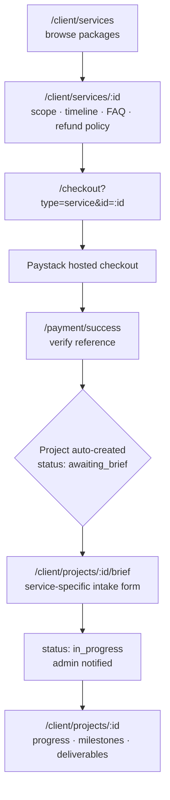

# Client Flow — Services, Purchase and Project Kickoff

How a client goes from browsing a service to having work started on it.

> This document began as a proposal. **The flow described here is built and
> live** — routes, statuses and endpoint paths below are the real ones. See
> [ARCHITECTURE.md](ARCHITECTURE.md) for system design and [API.md](API.md) for
> endpoint detail.

---

## The two paths

The services page carries both, because not every engagement fits a package:

```
/client/services
├── Productized packages ──→ Detail → Purchase → Checkout → Brief → Project
└── Custom engagements ────→ Detail → Inquiry form → Admin scopes → Quote
```

The split is a single flag on each catalog entry:

| `productized` | Behaviour | Count today |
|---|---|---|
| `true` | Fixed price, buyable instantly, has an intake form | **13** |
| `false` | Inquiry only — admin scopes and quotes it | **1** |

The catalog lives server-side in `backend/src/config/services.catalog.ts`, which
is also what makes the price authoritative — see
[the pricing note](#why-price-is-resolved-server-side) below.

---

## Path A — Self-serve purchase

### The flow, end to end



### Step by step

| # | Where | What happens |
|---|---|---|
| 1 | `/client/services` | Grid of packages, split into *Productized* and *Custom engagements* |
| 2 | `/client/services/:id` | Scope, deliverables, process, what's included **and excluded**, revisions, refund policy, FAQ |
| 3 | `/checkout?type=service&id=<id>` | Price resolved server-side; discounts applied |
| 4 | Paystack | Hosted checkout. Mobile hosts this in an in-app WebView |
| 5 | `/payment/success` | Verifies the reference against `GET /paystack/verify/:reference` |
| 6 | — | **Project auto-created** with `status: awaiting_brief`, `isPaid: true` |
| 7 | `/client/projects/:id/brief` | Service-specific intake form |
| 8 | — | On submit: `status → in_progress`, `startDate` set, admin notified |
| 9 | `/client/projects/:id` | Progress bar, milestones, deliverables, activity timeline |

### The post-payment gap this closes

Payment succeeding is not the same as work being able to start. Without a
structured intake, a paid project sits idle while someone asks *"what colours do
they want?"* over email.

`awaiting_brief` exists precisely to make that gap **visible and actionable**
rather than silent. A paid project in that state is unambiguous: money received,
work blocked on the client, and the client has a form waiting.

### Project creation is idempotent

`ensureProjectForServicePurchase()` looks up an existing project by
`paystackReference` before creating one. It is called from **two** places — the
verify endpoint and the Paystack webhook — and either may arrive first. Whichever
wins creates the project; the other is a no-op.

This matters because a client closing the tab mid-redirect must still end up with
a project. The webhook covers it.

---

## The intake brief

### Service-specific by design

A logo design needs different inputs than a UX audit, so each productized service
declares its own `intakeFields` in the catalog. Supported types:

| Type | Use |
|---|---|
| `text` | Short answers — business name, domain |
| `textarea` | Long answers — audience, page copy, references |
| `url` | Links to brand assets, existing sites |
| `select` | Single choice from `options` |
| `checkbox-group` | Multiple choices from `options` |

Each field carries `label`, optional `placeholder`, `helpText`, and `required`.

### Validation is server-side

`POST /projects/:id/brief` re-checks every `required` field against the catalog
before accepting. A client that skips the form fields cannot skip the
requirement — the endpoint returns `400` naming the missing labels.

It also rejects submission when `status !== 'awaiting_brief'`, so a brief cannot
be submitted twice. The page mirrors this by redirecting away if the project has
already moved on.

### What submission triggers

1. `brief` and `briefSubmittedAt` saved on the project
2. `status → in_progress`, `startDate` set if not already
3. A `milestone` entry added to the activity timeline
4. **Push** to all admins — *"Project brief received"*
5. **Email** to all admins with the full brief contents
6. **WhatsApp** to the client confirming kickoff (if a phone is on file and they
   have not opted out)

All four notifications are fire-and-forget. A failing email never blocks the
brief from being saved.

---

## Path B — Custom quote

For engagements that do not fit a package:

1. Client opens a non-productized service, or uses the *"Don't see what you
   need?"* CTA at the bottom of `/client/services`
2. Submits an inquiry — message, plus optional budget range and timeline
3. `POST /services/inquire` stores a `ServiceInquiry`
4. Admins are notified by **push** and **email**
5. Admin scopes the work and follows up with a quote

Name and email are **auto-filled from the authenticated user** and override
anything sent in the request body — an inquiry cannot be attributed to someone
else.

Admins work these from `/admin/service-requests`, where each inquiry has a status
they can advance.

---

## After the brief — project lifecycle

```
awaiting_brief ──→ in_progress ──→ review ──→ completed
                                      │
      pending ──────────────────┘     └──→ cancelled
```

`pending` is the entry state for admin-created projects that did not come from a
self-serve purchase.

### What the client sees at `/client/projects/:id`

- Progress percentage
- Timeline milestones with due dates and completion state
- Deliverables — named files with links
- GitHub repository and live site links, when set
- **Activity timeline** — a running log of updates

### The timeline logs itself

When an admin patches a project, meaningful changes are **auto-posted** as
activity entries. No separate step, so the log cannot silently fall out of sync
with reality:

| Admin change | Entry logged |
|---|---|
| `status` | `milestone` — *"Status changed to review"* |
| `progress` | `progress` — *"Progress updated to 60%"* |
| `githubRepo` set | `note` — *"Linked GitHub repository"* |
| `liveUrl` set | `deploy` — *"Live site published"* |

Admins can also post entries manually. Every update pushes a notification to the
client, and a WhatsApp message if they have opted in.

---

## Why price is resolved server-side

`POST /paystack/initialize` accepts a `serviceId` and looks the price up from the
server catalog. A client-supplied amount is **not trusted** for services.

Beyond the obvious tampering protection, this removes an entire class of bug:
the client and server cannot disagree about the total, because only one of them
has an opinion.

The same request applies stacked discounts in a fixed order — loyalty points,
then gift voucher, then referral credit — each capped by the remaining balance.
On payment failure all three are reversed.

Services above ₦200,000 may also be split into 2× or 3× installments, which
requires explicit auto-charge consent and is validated against the catalog's
`installmentEligible` flag.

---

## Where this ended up differing from the original plan

The proposal recommended productizing **3–5** services first and keeping custom
quotes as the broad fallback. What shipped is **13 productized to 1 inquiry-only**.

Worth knowing, because it inverts the intended safety margin: the custom-quote
path is now a narrow exception rather than a general catch-all. That is fine if
all 13 genuinely have fixed, repeatable scopes — the original caution was against
productizing work whose scope you cannot pin down, since a fixed-price package
with fuzzy boundaries absorbs the overrun.

If any of the 13 regularly need scope negotiation before work starts, they are
better served as inquiry-only.

---

## Related

- [API.md](API.md) — `/services`, `/projects`, `/paystack` endpoint reference
- [ARCHITECTURE.md](ARCHITECTURE.md) — data model, idempotent settlement
- [CASE_STUDY.md](CASE_STUDY.md) — why the platform is built this way
