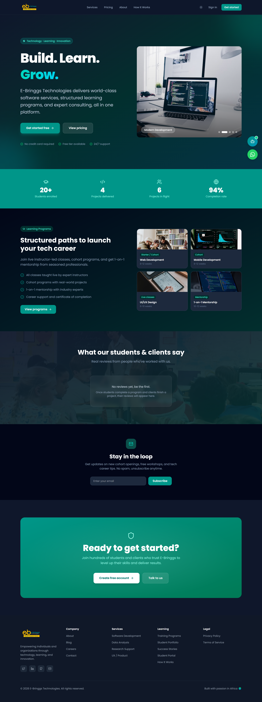

# E-Bringgs Technologies

**A single platform running a technology training academy and a software services agency — four user roles, three web apps, one API, and a Flutter mobile client.**

🔗 **Live:** [www.ebringgs.com](https://www.ebringgs.com) · 📸 **[Screenshots](screenshots/)** · 📖 **[Case study](CASE_STUDY.md)**



---

## The problem

E-Bringgs runs two businesses that most companies would keep apart:

1. **A training academy** — cohort-based programs in web development, mobile, UI/UX and data. Taught live, with assignments, recordings, certificates and a points leaderboard.
2. **A software services agency** — productized packages a client can buy outright, plus custom engagements that begin as an inquiry and become a scoped quote.

The obvious move is to build two products. That was rejected for three reasons:

- **The audiences overlap.** A client who hires the agency often sends staff through the academy. A graduating student becomes a candidate the agency places. Splitting the products splits the customer record.
- **One brand, one login.** Asking someone to hold two accounts for one company is a conversion tax on both sides of the business.
- **Payments are the same problem twice.** Both sides bill in naira, both need installments, both need receipts and refunds. Building that machinery twice is the single largest source of duplicated effort.

So the real problem was never "build a course site" or "build an agency site." It was:

> **Can four user types with genuinely different jobs share one identity system, one payment engine and one operational backend — without the interfaces collapsing into a compromise that serves nobody well?**

---

## What it does

| Role | Capabilities |
|---|---|
| **Student** | Enrol in cohorts, join live video classes, submit assignments, watch recordings, earn points, climb a leaderboard, claim certificates |
| **Client** | Buy productized services or request custom quotes, submit an intake brief, track project progress with milestones and deliverables, view payment history |
| **Teacher** | Run live sessions, record classes, grade assignments, manage their own profile |
| **Admin** | Manage users, cohorts, projects, payments, content, reviews, certificates, and inspect platform analytics |

Cross-cutting: JWT auth with silent refresh, NGN payments with installments and stacked discounts, WebRTC classroom, push and WhatsApp notifications, public certificate verification, dark mode throughout.

---

## Architecture at a glance

```
e-bringgs/                    backend/                    
├─ apps/                                 
│  ├─ web/       ├─ controllers/(23)            
│  ├─ admin/     ├─ models/(19)            go_router
│  └─ teacher/   ├─ signaling/      
└─ packages/                   └─ services/
   api · auth · classroom
   styles · types · ui
```

Three front-ends deploy independently but share six internal packages. The API is one Node process hosting **both** Express (`/api/*`) and a WebSocket signaling server (`/ws`) on a single port.

**Why three apps rather than one:** a prospective student loading the marketing site should never download the admin console. Route-level splitting inside one app helps, but nothing stops an admin-only dependency landing in a shared chunk. Separate builds make it impossible by construction, and separate subdomains mean an admin session cannot leak into the public origin.

Full detail in **[ARCHITECTURE.md](ARCHITECTURE.md)**.

---

## Challenges and solutions

### 1 · A total API outage that looked like an empty product

**Challenge.** The student dashboard reported *"Couldn't load tutoring programs."* The obvious read was a broken tutoring endpoint — but every API call from that origin was failing. That page was simply the only screen with an explicit error card. Everywhere else, failed fetches fell back to empty arrays, so a complete outage rendered as a platform that looked **empty rather than broken**.

The cause: CORS whitelisted the exact origin strings from environment variables. Visitors arrive via both apex and `www`, but only one form was configured.

| Origin | Result |
|---|---|
| `https://www.ebringgs.com` | 200 |
| `https://ebringgs.com` | 500 |
| `http://localhost:5173` | 500 |

Worse, the rejection path *threw*, which the global handler converted into a 500 — so routine cross-origin probes looked like server faults in the logs, burying the signal.

**Solution.** Each configured origin now expands into both apex and `www` forms. Localhost is allowed in all environments — safe here because auth is Bearer-token, so cross-origin requests carry no ambient cookie credentials. Disallowed origins are rejected cleanly with `cb(null, false)` instead of throwing.

**Principle taken forward:** empty and failed must never render identically. Every list view needs three distinct states — loading, error, and genuinely empty.

### 2 · Infrastructure latency masquerading as a bug

**Challenge.** Mobile sign-up failed with *"the request took longer than expected 0:0:20.000000."* Nothing was actually broken: the free-tier host spins containers down when idle, and the first request after a quiet period took **24 seconds** to boot and respond. The mobile HTTP client had a 20-second timeout, so it manufactured a failure against a backend that was merely waking up.

**Solution.** Timeouts raised to 60 seconds, and the client now distinguishes `connectionTimeout` from `connectionError` so "the server is waking up" reads differently from "you have no internet."

**Principle:** client timeouts encode an assumption about infrastructure. Know your deployment's cold-start cost and set timeouts above it — then treat reducing that cost as a separate problem.

### 3 · Auth that failed silently

**Challenge.** Mobile registration appeared to succeed and wrote nothing. The mobile `.env` pointed at `http://10.0.2.2:5000/api` — the Android emulator's alias for a local backend that was not running — while the web app pointed at production. The code default was equally wrong, so a missing config file degraded to *broken* rather than *working*.

**Solution.** Both the `.env` and the code fallback now point at the shared production API, and every auth error surfaces through two channels because the original failure produced no visible output at all.

**Principle:** defaults are used exactly when someone has not thought about the setting. Make the fallback the one that works for the most people.

### 4 · Stacked discounts on a single transaction

**Challenge.** A checkout can combine loyalty points, a gift voucher, referral credit **and** a 2×/3× installment split. Order matters, every discount is capped by the remaining balance, and a failed payment must reverse all of it. Two entry points confirm payment — the client redirect and the provider's webhook — and either may arrive first.

**Solution.** Three decisions contained it:

- **Price resolves server-side** from a catalog. A client-supplied amount is not trusted. Beyond tampering protection, this removes a whole class of "client and server disagree about the total" bugs, because only one of them has an opinion.
- **Balances decrement atomically** via a conditional `findOneAndUpdate` guarded on sufficient funds, so two parallel checkouts cannot spend the same referral credit twice.
- **Settlement is idempotent.** Both entry points call the same function, and every step within it is safe to repeat. Whichever arrives first wins; the other is a no-op.

### 5 · Four clients disagreeing about the same data

**Challenge.** Cohorts open and close with the clock. With three web apps and a mobile client each computing "is this cohort still open?", they would inevitably drift.

**Solution.** A `deriveXxxStatus()` helper computes effective status server-side from raw fields and the current time. Public controllers run it before responding; **clients never re-derive.** Four clients cannot disagree, because none of them decides.

**Principle:** when multiple clients consume the same data, any logic they each implement is logic that can drift. Compute once, server-side, and ship the answer rather than the inputs.

### 6 · A logo that could not be transparent

**Challenge.** The brand mark shipped as a JPG — a format with no alpha channel. The component compensated with `mix-blend-mode: multiply` in light mode and a white card in dark mode. The blend only *simulates* transparency over white; the card was a visible white box on dark sidebars.

**Solution.** Alpha was recovered mathematically by un-mixing each pixel from white. That immediately exposed a second problem the workaround had been hiding: the "technologies" wordmark is near-black and **vanished** on dark surfaces. Fixed with a second artwork tone and a three-value `tone: 'auto' | 'light' | 'dark'` prop — three values because a boolean cannot express the printable certificate, which renders on a hardcoded white background regardless of theme.

**Principle:** a workaround is load-bearing until proven otherwise. Removing one returns you to the original problem *plus* whatever else it was incidentally covering.

More incidents in **[LESSONS-LEARNT.md](LESSONS-LEARNT.md)**.

---

## Tech stack

**Web** — React 19 · TypeScript · Vite 7 · Tailwind CSS v4 (CSS-first config, no `tailwind.config.js`) · Zustand 5 (auth + theme) · TanStack Query 5 (server state) · React Router 7 · axios

**API** — Node · Express 4 · TypeScript · Mongoose 8 / MongoDB Atlas · JWT access + refresh · `ws` for signaling · Zod validation · Helmet · rate limiting · Swagger (`swagger-jsdoc`) · Multer · Paystack over raw `https`

**Mobile** — Flutter · Riverpod · go_router · Dio · flutter_webrtc · flutter_inappwebview

**Infra** — Vercel (web) · Render (API) · MongoDB Atlas

---

## Running locally

```bash
# Web apps — pnpm workspace
pnpm install
pnpm dev              # web + backend together
pnpm dev:admin        # admin console
pnpm dev:teacher      # teacher console

# API — separate repo, npm
cd ../backend
npm install
npm run dev           # NODE_ENV=development
npm run seed:admin    # create the first admin from ADMIN_* env vars

# Mobile — separate repo
cd ../e-bringgs-mobile
flutter pub get
flutter run
```

Quality gates:

```bash
pnpm typecheck        # all workspace packages
pnpm lint
```

The API needs `MONGO_URI`, `JWT_SECRET`, `JWT_REFRESH_SECRET`, `PAYSTACK_SECRET_KEY`, `GEMINI_API_KEY`, `SMTP_*` and the `CLIENT_URL` / `ADMIN_URL` / `TEACHER_URL` origins used by CORS.

> **No test runner is configured.** This is the project's most consequential trade-off — iteration speed was chosen over a safety net, and correctness currently rests on TypeScript, Zod at the route boundary, and manual verification. Payments are where that debt should be repaid first.

---

## Documentation

| Document | Contents |
|---|---|
| **[CASE_STUDY.md](CASE_STUDY.md)** | The full narrative — problem, architecture, trade-offs, roadmap |
| **[ARCHITECTURE.md](ARCHITECTURE.md)** | System diagrams, request and auth lifecycles, data model, conventions |
| **[API.md](API.md)** | Every endpoint with its authorisation level, envelopes, WebSocket protocol, webhooks |
| **[PERFORMANCE.md](PERFORMANCE.md)** | Measured latencies, caching layers, indexes, ranked bottlenecks |
| **[LESSONS-LEARNT.md](LESSONS-LEARNT.md)** | Shipped bugs, root causes, and the principle each produced |
| **[Client-flow.md](Client-flow.md)** | The service purchase → brief → project kickoff flow |
| **[screenshots/](screenshots/)** | 25 full-page captures of the live deployment |

Interactive API docs are served at `/api/docs` when the backend is running.

---

## Status

Live and serving traffic at [www.ebringgs.com](https://www.ebringgs.com).

**Known gaps, stated plainly:**

- **No automated tests.** The largest piece of technical debt.
- **Live classroom is partial.** Signaling, chat, presence and local media all work; peer video does not flow yet because neither client constructs an `RTCPeerConnection`. The hook is in place on both.
- **Admin and teacher consoles are not deployed.** They build and run locally but have no live subdomain yet.
- **Recordings sit on local disk**, so they do not survive a container replacement. Object storage is the next step.
- **Social sign-in is implemented but switched off** behind a feature flag, pending provider setup.
